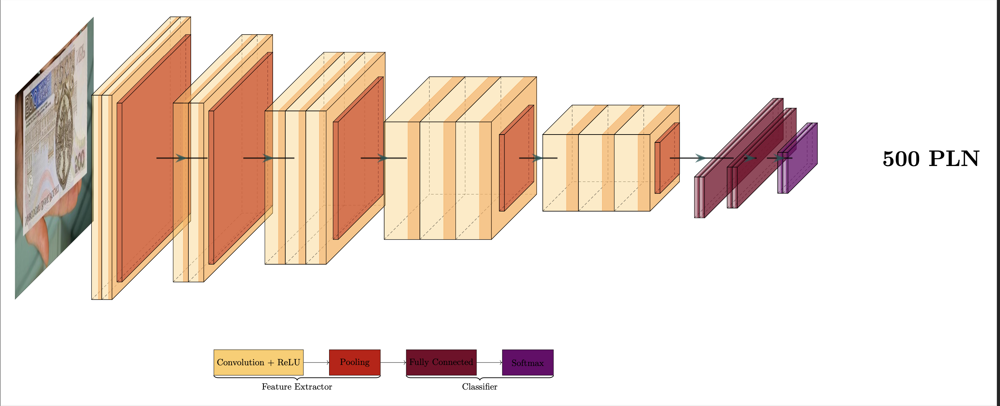

# SwUL Polish Banknote Detection



This repository contains a Convolutional Neural Network (CNN) based on the VGG16 architecture for detecting and classifying Polish banknotes.

## Features

- Comming soon!

## Installation

1. Clone the repository:
   ```bash
   git clone https://github.com/your-username/cnn-vgg16-pln-banknote.git
   cd cnn-vgg16-pln-banknote

